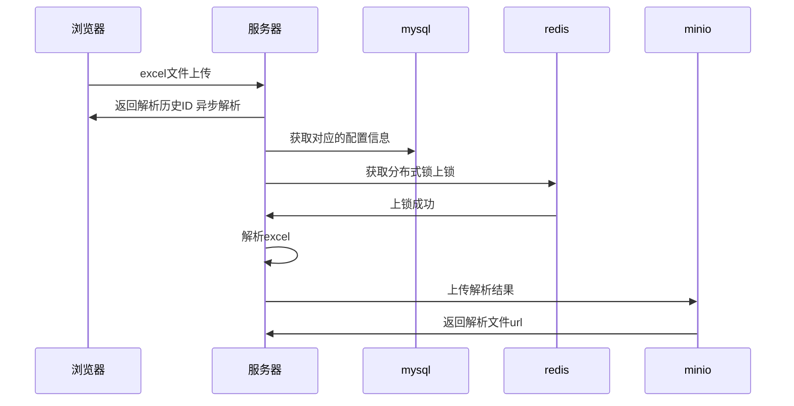

# 基于EasyExcel 的数据导入中心
## 项目说明
> 基于minio,redis中间件为基础,通过扩展EasyExcel支持大文档导入
## 性能
> 由于easyExecel 本身的高性能,配置step=1000 过程中无数据库解析在 10s 10万数据左右, 有数据库条件下瓶颈主要发生在mysql 存库也能在2分钟左右处理完,step=1000 甚至能在1分钟左右处理完,内存占用会相应比较多
## 工作流程
> 以基于 mysql 为例

## 目录说明
```bash 
├── README.md # 主文档
├── excel-context # 顶层接口,核心代码
├── excel-mysql-sample # 基于mysql的导入案例
├── excel-mysql-starter # 基mysql的starter
├── excel-simple-sample # 基于枚举配置,日志打印历史的导入案例
├── excel-simple-starter # 基于枚举配置,日志打印历史的starter
└── pom.xml 项目依赖管理
```
## 核心类讲解
```bash
excel-context/src/main/java/com/huyiyu/excel/
├── entity
│   ├── ImportConfig.java # 配置项规范,规定了excel解析行数,步长,上锁时间等相关内容
│   ├── ImportHistory.java # 上传历史规范,规定了作为历史需要有什么值
│   └── RowResult.java # 解析结果规范 至少要有错误信息和行号,其他根据业务需求做
├── factory
│   └── ExcelReadFactory.java # easyExcel 调用
├── list
│   └── RedisReadOnlyList.java # 扩展List实际存在redis中,解决大对象溢出
├── listener
│   └── ReadListenerAdapter.java # 通用的EasyExcel 解析Listener 
├── service
│   ├── AbstractImportService.java # 提供给用户实现的接口 所有导入对象实现Invoke 模板方法
│   ├── ImportConfigService.java # 提供获取配置的规范,一般使用枚举或mysql配置获取
│   ├── ImportHistoryService.java # 提供保存历史的规范实现
│   └── StorageService.java # 提供将解析结果上传到对象存储的规范实现,一般接入minio
└── util
    └── ExceptionUtil.java # 提供异常内容序列化成String 的实现
```
## 从0开始excel导入(业务)
1. 引入 excel-mysql-starter
2. 配置 excel-import-config 表
```sql
/*
project:项目,
read_step: 读取步长,修改后invoke 方法每次调用获取的size 会变多
write_step: 写入步长,每次读取步长结果会先缓存到redis 最终生成文档时,使用自定义的redisReadOnlyList 按批获取
title: 展示没啥卵用
type: 这个名称必须是 AbstractImportService 的泛型类的 SimpleName ,实际调用是通过这个泛型来获取配置然后根据配置执行的
max_row: 限制excel 最多多少行
sync: 设置同步异步
lock_second: 设置锁多久,这个值仅供参考,实际运行会自动续期
release_second: 设置锁在多久还没结束时自动移除,以免死锁
*/
INSERT INTO data_import.excel_import_config 
(id, project, read_step, write_step, title, type, max_row, sync, lock_second, release_second) VALUES 
(1, 'jrjg', 1000, 5000, '数据库测试导入', 'DbEntity', 100000, 0, 40, 300);
```
3. 编写业务代码实现AbstractImportService,并注册为spring的Bean,定义传入excel格式和Excel 结果格式(入参和返回值)

* 代码所示 type 的值为 DbEntity, map 入参的key 是行号,value 是每一行的具体内容
```java
@Service
public class DbImportService extends AbstractImportService<DbEntity> {

    @Resource
    private IDbTestService dbTestService;

    @Override
    public List<? extends RowResult> invoke(Map<Integer, DbEntity> data) {
        List<DbEntityResult> shortEntities = new ArrayList<>();
        List<DbTest> dbTests = new ArrayList<>();
        data.forEach((key, value) -> {
            if (key % 3 == 0) {
                DbEntityResult dbEntityResult = new DbEntityResult();
                dbEntityResult.setErrorMessage("不是奇数认为是错误的");
                dbEntityResult.setField10(value.getField10());
                dbEntityResult.setRowIndex(key);
                shortEntities.add(dbEntityResult);
            } else {
                DbTest dbTest = toDbTest(value);
                dbTests.add(dbTest);
            }
        });
        dbTestService.saveBatch(dbTests);
        return shortEntities;
    }

    private DbTest toDbTest(DbEntity value) {
        return new DbTest()
            .setField1(value.getField1())
            .setField2(value.getField2())
            .setField3(value.getField3())
            .setField4(value.getField4())
            .setField5(value.getField5())
            .setField6(value.getField6())
            .setField7(value.getField7())
            .setField8(value.getField8())
            .setField9(value.getField9())
            .setField10(value.getField10())
            .setField11(value.getField11())
            .setField12(value.getField12())
            .setField13(value.getField13())
            .setField14(value.getField14())
            .setField15(value.getField15())
            .setField16(value.getField16())
            .setField17(value.getField17())
            .setField18(value.getField18())
            .setField19(value.getField19())
            .setField20(value.getField20());
    }
}
```
* 示例返回值中,可以定义中文字段名,定义出错原因,定义返回部分字段,行号和错误原因必填方便业务人员修改重新上传,同样EasyExcel 内容支持
```java
public class DbEntityResult implements RowResult, Serializable {

    @ExcelProperty("行号")
    private int rowIndex;
    @ContentFontStyle(color = Font.COLOR_RED)
    @ExcelProperty("失败原因")
    private String errorMessage;
    @ExcelProperty("展示字段")
    private String field10;
}
```
4. 外部Controller 调用 DbImportService 父类方法 doRead 并将InputStream 传递给doRead
```java
@PostMapping("excelUpload")
public Object upload(MultipartFile file) throws IOException {
    long integer = service.doRead(file.getInputStream());
    // 实际通过判断ID的返回来确定任务是否执行成功
    return integer;
}
```
5. 根据实际上传时间和内存占用调整step 的大小 step 越大理论上速度会加快,但内存占用会相应增加
## 源码解析
### AbstractImportService 模板类
```java

public Long doRead(InputStream inputStream) {
    // 获取当前泛型上class 的简单名称 并通过这个名称获取配置信息
    String simpleName = clazz.getSimpleName();
    ImportConfig config = importConfigService.getConfig(simpleName);
    // 初次保存历史,并得到一个HistoryId
    ImportHistory importHistory = importHistoryService.newImportHistory(config);
    if (log.isDebugEnabled()) {
        log.debug("当前类型:<{}>,使用<{}>的方法解析Excel", simpleName, config.getSync() ? "同步" : "异步");
    }
    // 同步就直接执行, 而异步使用线程池去执行,为什么不用Async 因为 
    // 1. 会和事务冲突
    // 2. 后期如果想做对一个任务做中断比较方便 可通过获取FutureTask 去操作
    if (config.getSync()) {
        read(simpleName, config, inputStream,importHistory);
    } else {
        threadPoolTaskExecutor.submit(() -> read(simpleName, config, inputStream, importHistory));
    }
    return importHistory.getId();
}


private ReadListenerAdapter<T> read(String simpleName, ImportConfig config,
    InputStream inputStream, ImportHistory importHistory) {
    // 获取分布式锁,通过配置配置分布式锁
    String lockName = DATA_IMPORT_LOCK_PREFIX + simpleName;
    RLock lock = redissonClient.getLock(lockName);
    try {
    
        boolean getLock = lock
            .tryLock(config.getLockSecond(), config.getReleaseSecond(), TimeUnit.SECONDS);
        if (getLock) {
            //通过doRead 发起真正的excel解析,并将 invoke(编写的业务逻辑) 以回调的形式传给Factory
            return excelReadFactory.doRead(inputStream, clazz, this::invoke, config, importHistory);
        } else {
            log.warn("lock:<{}>在<{}>秒内未获取到分布式锁,请调长等待时间", lockName, config.getLockSecond());
            return null;
        }
    } catch (InterruptedException e) {
        throw new RuntimeException(e);
    } finally {
        lock.unlock();
    }
}
```
### ExcelReadFactory
> 工厂类主要是为了将 StorageService,ImportHistoryService,RedisTemplate 整合起来传递给Listener
这里没有什么特别重要的代码 不过加了@Transaction 使导入流程在同一个事务内,

```java
@Slf4j
@Setter
public class ExcelReadFactory {

    private StorageService storageService;

    private ImportHistoryService importHistoryService;

    private RedisTemplate redisTemplate;

    @Transactional
    public <T> ReadListenerAdapter<T> doRead(InputStream inputStream, Class<T> clazz,
        Function<Map<Integer, T>, List<? extends RowResult>> callback,
        ImportConfig config, ImportHistory importHistory) {
        ReadListenerAdapter<T> readListenerAdapter = null;
        try {
            readListenerAdapter = new ReadListenerAdapter<>(config,
                importHistoryService, storageService, callback, importHistory, redisTemplate);
            EasyExcel.read(inputStream, clazz, readListenerAdapter).sheet().doRead();
        } catch (Exception e) {
            //此处抛出异常也不会有打印,直接log即可,该线程归还给线程池
            importHistoryService
                .updateExceptionById(ExceptionUtil.toString(e), importHistory.getId());
            log.error("type:<{}>HistoryId<{}>导入时发生异常", config.getType(), importHistory.getId(), e);
            // 抛出异常让事务回滚
            throw new RuntimeException(e);
        }
        return readListenerAdapter;
    }
}
```
### ReadListenerAdapter
> 该对象不是spring 的Bean 所以需要通过Factory将对象传递给Adapter 使用doRead方法调用出发Listener的生命周期
```java
@Slf4j
public class ReadListenerAdapter<T> implements ReadListener<T> {

    // redis 中保存的excel 处理结果的前缀,实际的key会拼上 type 和 historyId
    private static final String EXCEL_RESULT_PREFIX = "EXCEL_RESULT:";
    // 配置信息
    private final ImportConfig importConfig;
    // 历史
    private final ImportHistoryService importHistoryService;
    // 对象存储
    private final StorageService storageService;
    // 业务回调,每次达到readStep时会触发一次回调,然后整理结果
    private final Function<Map<Integer, T>, List<? extends RowResult>> callback;
    // 缓存解析的行号和数据,达到readStep 就会触发一次回调
    private final Map<Integer, T> cachedData = new TreeMap<>();
    // 将结果存入redis List 队列中
    private final RedisTemplate redisTemplate;
    // 上文所说的结果key
    private final String RESULT_KEY;
    @Getter //目前没有用,方便后续暴露给监控监控解析的行
    private volatile int currentRow;
    @Getter //目前没有用,方便后续暴露给监控监控解析的行
    private volatile int endRow;
    @Getter // 统计总行数
    private int totalRow;
    //  解析历史
    private ImportHistory importHistory;
    // 统计解析时间保存到解析历史
    private StopWatch stopWatch;

    // 初始化
    public ReadListenerAdapter(ImportConfig importConfig,
        ImportHistoryService importHistoryService, StorageService storageService,
        Function<Map<Integer, T>, List<? extends RowResult>> callback,
        ImportHistory importHistory, RedisTemplate redisTemplate) {
        this.importConfig = importConfig;
        this.importHistoryService = importHistoryService;
        this.storageService = storageService;
        this.callback = callback;
        this.importHistory = importHistory;
        this.redisTemplate = redisTemplate;
        this.RESULT_KEY = EXCEL_RESULT_PREFIX + importConfig.getType() + ":" + importHistory.getId();
        stopWatch = new StopWatch(importConfig.getType());
        stopWatch.start();
    }

    @Override
    public void onException(Exception exception, AnalysisContext context) {
        log.error("historyId:<{}> 导入发生异常,请查询History记录", importHistory.getId());
        importHistory.setErrorMsg(ExceptionUtil.toString(exception));
        importHistory.setSuccess(false);
        if (stopWatch.isRunning()) {
            stopWatch.stop();
            importHistory.setTimeMillis(stopWatch.getTotalTimeMillis());
        }
        importHistoryService.updateById(importHistory);
    }

    @Override
    public void invoke(T data, AnalysisContext context) {
        // 每次解析一行数据触发一次 
        if (log.isDebugEnabled()) {
            log.debug("解析到一条数据:{}", data);
        }
        // 先缓存到cachedData 中,和ReadStep 相比,如果等于则触发一次step 此时回调业务代码
        cachedData.put(context.readRowHolder().getRowIndex(), data);
        int step = importConfig.getReadStep();
        this.currentRow = context.readRowHolder().getRowIndex();
        if (step > 0 && cachedData.size() >= step) {
            totalRow += cachedData.size();
            endRow = currentRow + cachedData.size();
            clearAndCollectResult();
        }
    }

    private void clearAndCollectResult() {
        if (importConfig.getMaxRow() < totalRow) {
            throw new ExcelAnalysisException(
                "类型:<" + importConfig.getType() + ">,总条数:<" + totalRow + ">超过最大限制条数:<"
                    + importConfig.getMaxRow() + ">");
        }
        // 回调触发
        List<? extends RowResult> errorResult = callback.apply(cachedData);
        // 将结果放入redis 防止内存溢出
        redisTemplate.opsForList().rightPushAll(RESULT_KEY, errorResult);
        // 清空缓存列表
        cachedData.clear();
    }

    
    @Override
    public void doAfterAllAnalysed(AnalysisContext context) {
        // 所有数据解析完后先看一下CacheList 有没有内容,有要再触发一次Callback
        if (!cachedData.isEmpty()) {
            totalRow += cachedData.size();
            this.endRow = currentRow + cachedData.size();
            clearAndCollectResult();
        }
        // 上传结果文件到minio
        writeImportHistory(context);
    }

    private void writeImportHistory(AnalysisContext context) {
        // 自定义一个支持延迟的List, 每次先取 writeStep 条,遍历完了再去redis 取
        RedisReadOnlyList<RowResult> rowResults = new RedisReadOnlyList<>(RESULT_KEY, redisTemplate.opsForList(),importConfig.getWriteStep());
        if (!rowResults.isEmpty()) {
            RowResult rowResult = (RowResult) redisTemplate.opsForList().index(RESULT_KEY, 0);
            // 直接尝试获取第一个元素的Class 对象作为结果的表头
            Class<?> head = rowResult.getClass();
            // eaexcel 需要我们提供一个OutputStream 而不是给我们实际的数组 这里有两种方案
            // 1. 使用管道流 一边读一边写给minio,实际编码中由于EasyExcel 强制关闭流会报错 
            // 2. 使用ByteArrayOutputStream 获取到实际的byte数组,从而得到输出流 目前采用该方案
            String url = storageService.upload(outputStream -> {
                EasyExcel.write(outputStream, head).sheet("result").doWrite(rowResults);
            });
            importHistory.setFileUrl(url);
            redisTemplate.delete(RESULT_KEY);
        }
        importHistory.setSuccess(true);
        importHistory.setTotalRow(totalRow);
        importHistory.setSuccessRow(totalRow - rowResults.size());
        importHistory.setFailureRow(rowResults.size());
        stopWatch.stop();
        importHistory.setTimeMillis(stopWatch.getTotalTimeMillis());
        // 上传结束 修改上传历史数据
        importHistoryService.updateById(importHistory);
    }
}
```