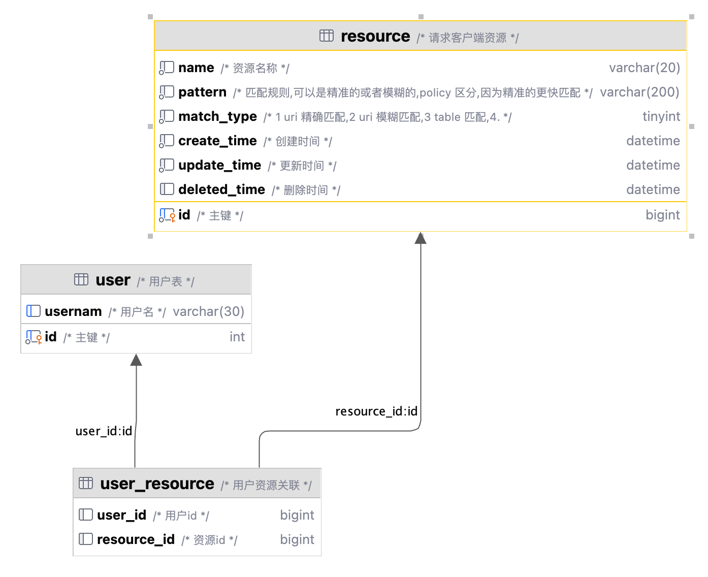
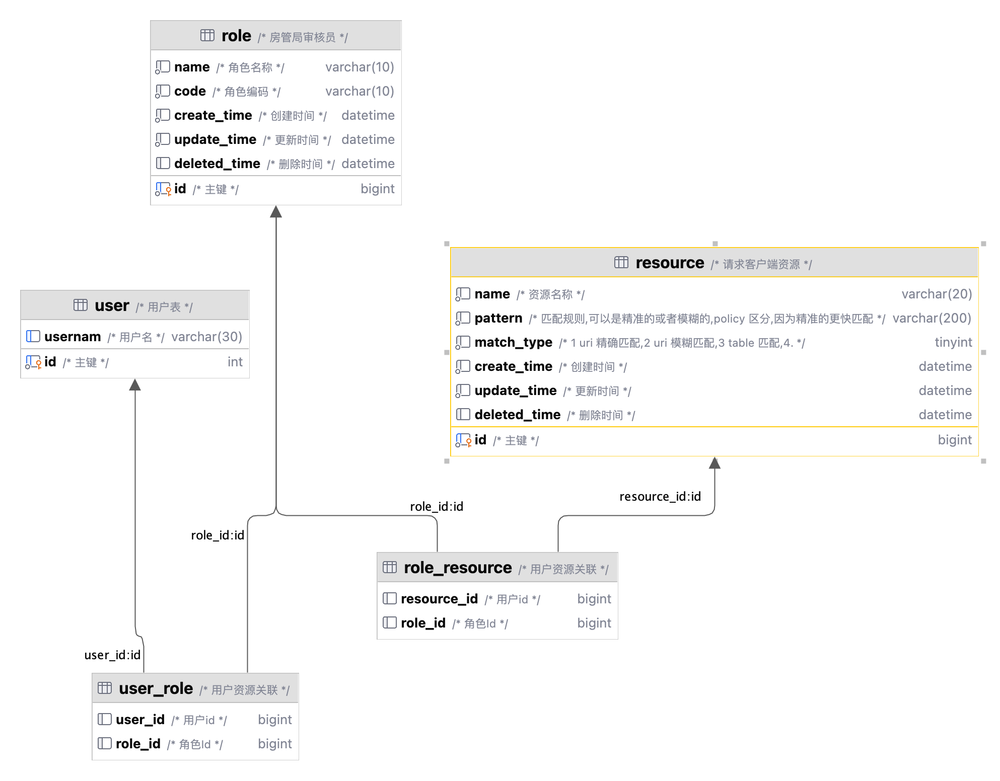
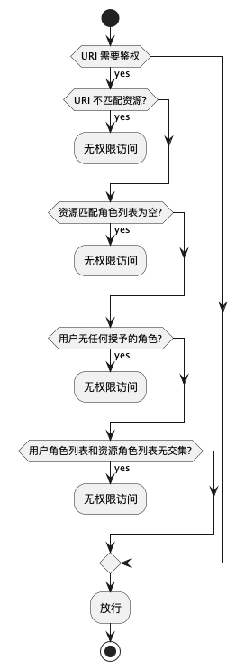
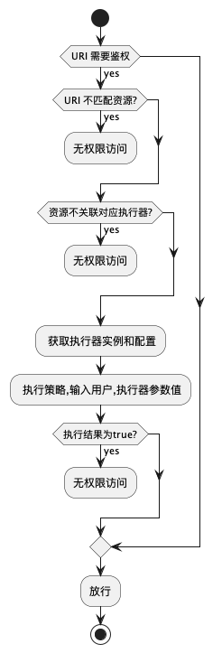

#


基于策略的权限设计

## 1. 背景
> 随着勒索病毒肆意爆发、大规模敏感数据泄露、针对性的黑客攻击等各类问题的频发，信息安全已经成为全社会关注的焦点.。现有的各类安全问题绝大多数可以归结为信任问题，如特定网络边界间默认信任问题、身份伪造骗取信任问题、会话或代码执行过程中劫持信任问题等。我们需要对安全信任做更精细化的全生命周期的管理，而像ACL，RBAC，等设计方案很难做到较为严格的权限控制基础，如实现反向访问控制，ABAC整体执行能力较差(基于ABAC模型中的conf文件内部的表达式来实现),

## 2. 什么是基于策略的权限设计(ACL/RBAC/ABAC/PBAC 对比)

### 2.1 简单比对

| 授权\属性 | 名称               | 执行描述                                                                  | 使用场景                                  | 优点                                                                                              | 缺点                                                                                                        |
| --------- | ------------------ | ------------------------------------------------------------------------- | ----------------------------------------- | ------------------------------------------------------------------------------------------------- | ----------------------------------------------------------------------------------------------------------- |
| ACL       | 访问控制列表       | 为每个用户匹配不同的读写执行权限                                          | linux文件目录权限设计                     | 简单,直观                                                                                         | 权限规则随着用户数量膨胀                                                                                    |
| RBAC      | 基于角色的权限控制 | 将相同同权限归集到角色上,为用户授予角色                                   | 大部分业务系统(腾讯云)中间件管理方案(k8s) | 权限规则收敛到角色                                                                                | 无法解决如树节点包含,时间维度,范围限定等复杂范围的权限控制,强行划分资源后也会造成角色膨胀,同时比ACL更难理解 |
| ABAC      | 基于属性的权限控制 | 资源权限不直接和角色关联,通过描述文件的表达式计算和用户具有的属性综合判断 | 可能实现反向控制,不会造成角色的膨胀,      | 执行能力离较弱,官方标准太过固定，目前支持的产品较少（k8s由于早期采用ABAC导致整体权限配置比较复杂) |                                                                                                             |
| PBAC      | 基于策略的权限控制 | 定义不同的策略执行器,在策略中对属用户访问的资源做匹配计算                 | authing,0信任网络搭建                     | 存在反向控制,执行能力强,策略灵活                                                                  | 缓存设计复杂,执行效率比RBAC 慢,用户权限范围视图较难展示 |

### 2.2 数据库结构比对






### 2.3 流程比对
>RBAC和PBAC流程如下:





### 2.4 对比分析总结
>ACL 是最简单的模型,缺点在于现实社会中大部分用户是可以分组的,通过角色的授权来减少重复的授权规则定义工作能简化操作

> RBAC 吸取了ACL 的教训,对角色进行授权,将相似的人归集到统一类型的角色中，并且用户和角色是多对多关系,可以一人身兼多个角色，灵活的配置出更加贴合现实场景的情况。但是对于资源的访问是以相等作为匹配原则,只能处理是或否的问题，无法处理更大范围的匹配关系。如员工只能在工作时间使用电脑访问内部数据，这里的“工作时间”便很难通过角色的对等匹配关系来描述。如果强行描述要么入侵业务(业务代码判断什么时间点是工作时间),要么角色膨胀(定义多个资源工作时间/非工作时间)

> PBAC 吸取了 RBAC 的角色匹配关系的缺点,通过动态的执行器，对用户和资源以及配置条件进行求解,通过求解结果来判断是否满足从而判断是否拥有权限的方案,避免了 RBAC 带来的缺点,但是引入了更多的概念,从而使编码更加复杂。并且对缓存的设计也更难,必须区分好静态匹配（类似RBAC）和动态匹配（如根据时间轴,从属关系,树级关系等场景的匹配）

## 3. 如何落地一个基于策略的权限设计
### 3.1 数据库设计


> 根据上文内容取消 role resource 表,并根据实际情况修改,如图所示是一个房产销售的数据库设计demo
* PBAC 的核心policy_define,policy_instance policy_instance_resource resource 表,
* 其他的表作为业务场景是配的表 account 是账号表,role 是角色表 role 不再直接关联resource 
* customer,salesman,house_management_admin 作为account 的子表
* 其他表可按名字区分 bill 作为业务数据汇总

>由上图可以设计几种场景 resource 可以控制所有的权限定义包含URI 或者数据库表以及记录,目前按照PBAC实现两个策略

1. 拥有role 为 customer 的用户可以访问 bill/page 接口
2. account 属于 house_management_admin 的用户在 2024-08-05 09:00:00 到 2024-09-05 09:00:00 时间段内可访问

> 基于以上两个条件实现PBAC

### 3.1 spring-security 简单设计
> spring security 是 spring 提供的用于权限校验的框架 利用其大部分的能力可以快速搭建认证鉴权系统,它的执行原理主要利用过滤器链来实现认证鉴权 通常最后一个过滤器 `AuthorizationFilter` 包含着鉴权代码,为搭建一个建议认证鉴权系统可使用下面配置代码
```java
  @Bean
  public SecurityFilterChain springFilter(HttpSecurity http,
      UriPolicyAuthorizationManager uriPolicyAuthorizationManager)
      throws Exception {
    // 使用JWT 辅助鉴权 借用OAUTH 机制实现 
    return http
        .oauth2ResourceServer(oauthServer -> oauthServer
            .bearerTokenResolver(new HeaderBearerTokenResolver(JWT_HEADER))
            // 控制jwt 校验不通过失败处理
            .authenticationEntryPoint(this::loginFailure)
            // 控制如何将 JWT header 转化为OAUTH 需要的JWT 密钥的代码
            .jwt(jwtConfigurer -> jwtConfigurer
                .decoder(jwtService)
                .jwtAuthenticationConverter(jwtService::convertJwt)
            ))
        // 控制用户名密码登录的uri 以及登录成功和失败的响应时间
        .formLogin(formlogin -> formlogin
            .loginProcessingUrl("/auth/login")
            .successHandler(this::onLoginSuccess)
            .failureHandler(this::loginFailure)
        )
        .csrf(csrf -> csrf.disable())
        .headers(headersConfigurer -> headersConfigurer.xssProtection(
                xssConfig -> xssConfig.headerValue(HeaderValue.ENABLED_MODE_BLOCK)
            ).addHeaderWriter(new TraceIdHeaderWriter())
        )
        .logout(logout -> logout.disable())
        // 控制PBAC入口的代码
        .authorizeHttpRequests(auth -> auth
            .anyRequest()
            .access(uriPolicyAuthorizationManager)
        )
        .cors(cors -> cors.disable())
        // 自定义返回 UserDetail 方便脚本编写
        .userDetailsService(userDetailsService)
        .sessionManagement(session -> session.disable())
        .httpBasic(httpBasic -> httpBasic.disable())
        .exceptionHandling(exceptionHandling -> exceptionHandling
            // 控制认证不通过结果处理的代码
            .accessDeniedHandler(this::accessDenied)
            // 控制密码登录失败处理的带啊
            .authenticationEntryPoint(this::loginFailure))
        .build();
  }
```
### 3.2 策略定义/策略实例/资源策略
```java 
/**
 * 所有的登录成功的带啊最终都会走到check 去校验URI 对应的权限
 * 上文中access配置了所有uri 都在这里统一鉴权 如果PolicyMatcher.decide 返回true 则鉴权成功 否则失败
 * 
 */ 
public AuthorizationDecision check(Supplier<Authentication> authentication,
    RequestAuthorizationContext object) {
if (authentication.get() instanceof LoginUserAcuhenticationToken loginUserAcuhenticationToken) {
    LoginUser principal = loginUserAcuhenticationToken.getLoginUser();
    return policyMatcher.decide(object.getRequest(), principal) ? ACCEPT : DENY;
}
return DENY;
}
```

```java
// 通过模板方法定义policyMatcher 的实现,目前规划两种实现,基于URI的正向控制和基于数据库Table的反向控制
@Override
  public List<Pair<Long, String>> match(HttpServletRequest httpServletRequest) {
    // 通过请求的路径匹配资源表对其描述
    // 从而找到对应的policyDefine 和PolicyInstance 
    return getResourceIdByPattern(httpServletRequest)
        .map(resourcePolicyInstanceService::listPairByResourceId)
        .orElse(new ArrayList<>());
  }

  // 获取执行对应的Handler 根据表中的HandlerName 和script 确定使用脚本引擎或spring 中定义好的执行器
  @Override
  public PolicyHandler getPolicyHandler(Long policyId) {
    PolicyDefine policy = policyDefineService.getById(policyId);
    if (StringUtils.hasText(policy.getHandlerName()) && policyHandlers.containsKey(
        policy.getHandlerName())) {
      return policyHandlers.get(policy.getHandlerName());
    } else {
      return new GroovyPolicyHandler(policy.getScripts());
    }
  }

  // 获取所有的执行器执行,若有一个执行器评估返回true 则 策略通过
  default boolean decide(P pattern, PolicyUser user) {
    List<Pair<Long, String>> matchePolicys = match(pattern);
    if (CollectionUtil.isNotEmpty(matchePolicys)) {
      for (Pair<Long, String> pair : matchePolicys) {
        PolicyHandler policyHandler = getPolicyHandler(pair.getKey());
        if (policyHandler.decide(user, pair.getValue())) {
          return true;
        }
      }
    }
    return false;
  }
```
### 3.3 不同策略的执行器的实现

1. 基于角色的执行器
```java
public class RolePolicyHandler implements PolicyHandler {

  @Data
  public static class RoleParam{
    private String roleCode;
  }

  @Override
  public boolean decide(PolicyUser user, String policyParam) {
    // 解析 流程实例表中的policyParam 实际内容为 {"roleCode":"customer"}
    if (StringUtils.hasText(policyParam)) {
      RoleParam roleParam = JsonUtil.json2Object(policyParam, RoleParam.class);
      List<String> roles = (List<String>) user.attribute(LoginUser.ROLE_NAMES_KEY);
      // 判断当前用户是否有该角色
      return !CollectionUtils.isEmpty(roles) && roles.contains(roleParam.getRoleCode());
    }
    return false;
  }
}
```
2. 基于时间的执行器

```java
public class TimePolicyHandler implements PolicyHandler {

  private final IHouseManagementAdminService houseManagementAdminService;


  @Data
  public static class TimeParam {
    private LocalDateTime startTime;
    private LocalDateTime endTime;
  }

  @Override
  public boolean decide(PolicyUser user, String policyParam) {
    if (user instanceof LoginUser loginUser) {
      // 获取accountId 先判断在houseManagement是不是存在
      Long accountId = Long.parseLong(loginUser.attribute(LoginUser.ACCOUNT_ID_KEY).toString());
      if (!houseManagementAdminService.contains(accountId)) {
        return false;
      }
      // 在判断当前时间是不是在流程实例中配置的开始时间和结束时间的中间段
      TimeParam timeParam = JsonUtil.json2Object(policyParam, TimeParam.class);
      if (timeParam.getStartTime() == null || timeParam.getEndTime() == null) {
        log.warn("该次匹配未填写开始时间和结束时间,检查policyResource配置");
        return false;
      }
      return timeParam.getStartTime().isBefore(LocalDateTime.now())
          && timeParam.getEndTime().isAfter(LocalDateTime.now());
    }
    return false;
  }
}
```
## 4.总结
>ACL 是最简单的模型,缺点在于现实社会中大部分用户是可以分组的,通过角色的授权来减少重复的授权规则定义工作能简化操作

> RBAC 吸取了ACL 的教训,对角色进行授权,将相似的人归集到统一类型的角色中，并且用户和角色是多对多关系,可以一人身兼多个角色，灵活的配置出更加贴合现实场景的情况。但是对于资源的访问是以相等作为匹配原则,只能处理是或否的问题，无法处理更大范围的匹配关系。如员工只能在工作时间使用电脑访问内部数据，这里的“工作时间”便很难通过角色的对等匹配关系来描述。如果强行描述要么入侵业务(业务代码判断什么时间点是工作时间),要么角色膨胀(定义多个资源工作时间/非工作时间)

> PBAC 吸取了 RBAC 的角色匹配关系的缺点,通过动态的执行器，对用户和资源以及配置条件进行求解,通过求解结果来判断是否满足从而判断是否拥有权限的方案,避免了 RBAC 带来的缺点,但是引入了更多的概念,从而使编码更加复杂。并且对缓存的设计也更难,必须区分好静态匹配（类似RBAC）和动态匹配（如根据时间轴,从属关系,树级关系等场景的匹配）

1. 没有一项技术能完美解决所有问题又没有缺点(人月神话中描述的银弹是不存在的)
2. 使用PBAC不意味着完全放弃RBAC 对于URI 资源访问,为了避免问题复杂化RBAC是一个主要方案,可以辅助一些其他策略做补充
3. 对于数据权限的设计目前没有一种完美的方案可以规避所有问题,执行效率,学习成本,校验准确率形成不可能三角三者只能选取其二(尤其是面对列表范围问题)

## 5. 展望
### 5.1 结合规则引擎动态Handler
> 实际工作中为了保证时效性,会将执行器的代码写成动态语言,比如groovy 放到policy_define 的script 中,通过脚本控制有实时生效和灵活的优点；同时也有着效率比spring bean 慢并且对于不熟悉的开发人员可能存在注入的风险。实际工作中要权衡两者利弊,如果为了性能或者没有进行太过于复杂的业务可长期使用 Spring Bean的方案,若有突发情况可通过开启脚本Handler 实现一些非常规的权限校验。

### 5.2 数据权限设计(基于授权前后机制的拦截)
> 
1. 对数据权限的校验得树立反向概念,数据库表或数据库表中的记录才是所谓的 “资源”(表通常认为是记录的模糊匹配,类似基于 antMatcher 的URI路径,与精确匹配的URI路径一致),转变之后才能考虑如何设计这个数据权限 (总结上文 表或记录是上文提及的resource 资源)
2. 数据库的鉴权和URI的略有不同主要体现在对数据库的操作不同可分为单次操作和批量操作
    * 对于ById 的操作无论是 修改/删除/更新 我们可以直接拒绝返回权限不足。
    * 而对于 Range 类型的操作如: 查看分页信息,按条件批量更新(不允许这么做),批量插入数据(大概率不需要权限校验) 却不能直接返回拒绝,也不能简单过滤掉数据因为这样返回的数据可能与业务场景不一样,本来分页需要返回10条 由于数据权限的过滤却只能返回5条,所以对于该困难有以下几种解决方案。
        * 干预 PreAuth 阶段,将数据权限的内容编程sql 中的条件拼接到执行的语句中,这样不会影响返回条数，但只支持单表查询,对于多表查询可能会有歧义
        * 干预 PostAuth 阶段,通过流式查询返回数据,如果发现实际与预期不符合再多查几条,这样绑架了业务一定要使用流式查询或者游标去做。
3. 综上,数据权限的方案一般都没有特别完整的方案,要结合自己的系统考虑,无论是通过PreAuth 阶段还是流式查询都有其优缺点。要根据实际情况给出方案,未来考虑通过DataSourceProxy 的方案对执行SQL做数据权限校验。 等待大家一起完善方案