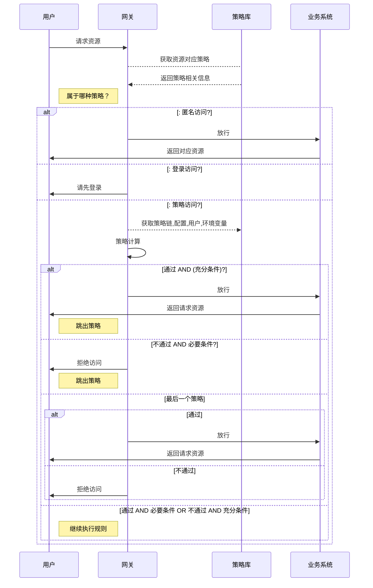

# 分布式场景下落地实践 

## 背景
>基于之前的 demo 是单体项目,分布式场景下,一般会在网关进行鉴权。按照之前PBAC执行时序图如下:

```mermaid
sequenceDiagram
    participant user as 用户
    participant gateway as 网关
    participant repo as 策略库 
    participant business as 业务系统

    user ->> gateway: 请求资源
    gateway --> repo: 获取资源对应策略
    repo -->> gateway: 返回策略相关信息
    Note left of gateway: 属于哪种策略？
    alt: 匿名访问?
        gateway ->> business: 放行
        business->> user : 返回对应资源
    else: 登录访问?
        gateway ->> user: 请先登录
    else: 策略访问?
        gateway -->> repo: 获取策略链,配置,用户,环境变量
        gateway ->> gateway: 策略计算
        alt 通过 AND (充分条件)?
            gateway ->> business: 放行
            business ->> user: 返回请求资源
            Note left of gateway: 跳出策略
        else 不通过 AND 必要条件?
            gateway ->> user: 拒绝访问
            Note left of gateway: 跳出策略
        else 最后一个策略
            alt 通过
                gateway ->> business: 放行
            business ->> user: 返回请求资源
            else 不通过
                gateway ->> user: 拒绝访问
            end
        else 通过 AND 必要条件 OR 不通过 AND 充分条件
            Note left of gateway: 继续执行规则
        end
    end
```

