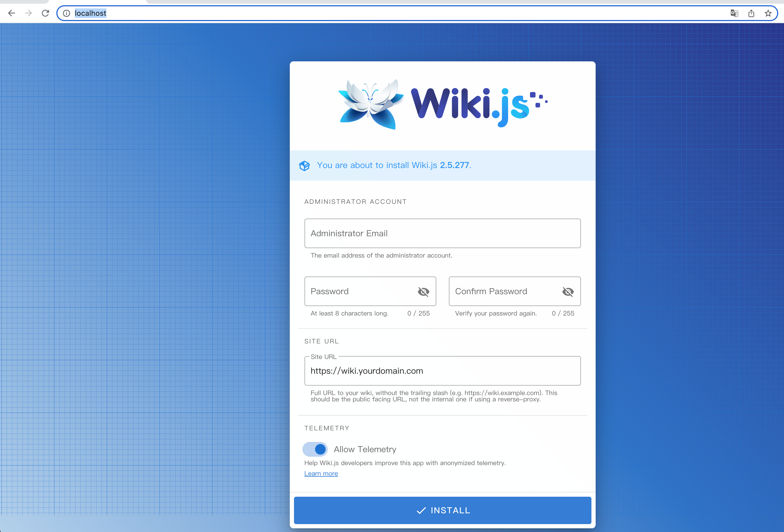
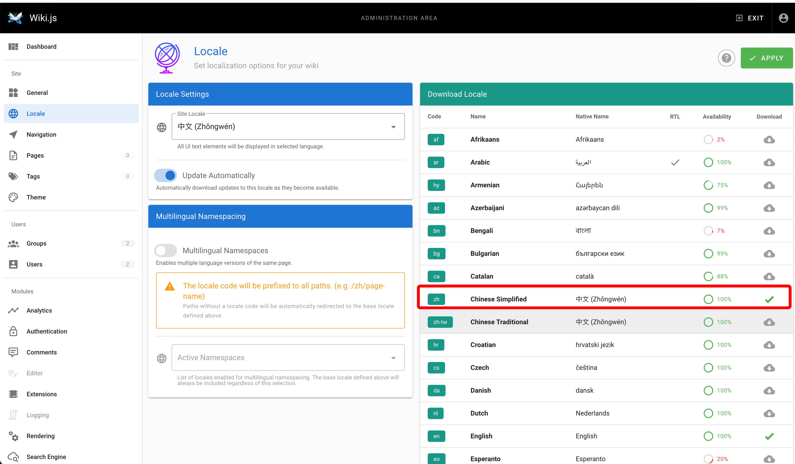
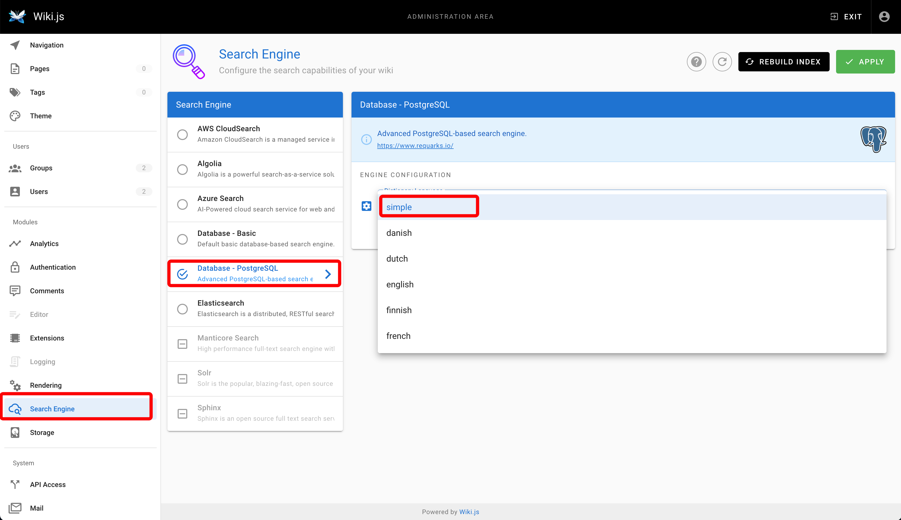

# wiki js 搭建

## 保存镜像
```bash
# 1. 保存镜像
docker save postgres:11-alpine ghcr.io/requarks/wiki:2 internetsystemsconsortium/bind9:9.18 > wiki.tar
# 2. 如果仍然太大可以用gzip压缩 可压缩到大概195M 
gzip -9 wiki.tar
```
## 导入镜像
```bash
docker load < wiki.tar.gz
```
## 新建数据目录并启动
```bash
mkdir -p ./data/db
docker-compose up -d
```
## 访问页面
### 设置 admin 账号密码


* admin 邮箱:admin@jfy.com
* 密码: hc1w0U1k4%BY6%mU%Gq4HVf
* 主站域名: http://wiki.huyiyu.top
### 登陆

### 设置语言和搜索引擎



## 备份
* postgreSql 的数据目录 data/db 的迁移
* 使用postgres 提供的[pg_dump]()

```bash
# 备份数据 类似mysqldump
docker-compose exec db pg_dump -f /var/lib/postgresql/data/backup.sql -U wikijs  wiki
# 还原数据
docker exec -i postgresql psql -U wikijs  wiki data/backup.sql
```